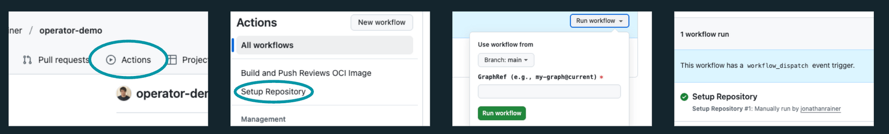

# Ship with Kubernetes 

This is a workshop that will be running as part of the 2026 OttawaU hack event. 

Press the "**Use this template**" button to make a copy of this template into your personal
GitHub account!

Below are some of the commands we're using in the workshop to allow for ease of copying!

## Pre-requisites

You will need:

1. A personal GitHub account
2. Install Docker or an equivalent tool to run containers
3. Install kind to run local Kubernetes clusters using Docker container "nodes"


Steps: 

1. Configure GitHub repository

    a. Go to the workshop's project repository and click Use this template.

    b. Make sure the Owner is set to your own personal GitHub account.

    c. Give it a name, we'll use sm-workshop-demo.

    d. Set the visibility to Public.

    e. Click Create repository.

    f. Go to Settings -> Actions -> General.

    g. Scroll down to Workflow Permissions and enable "Read and write permissions" under .

    h. Enable "Allow GitHub Actions to create and approve pull requests".

    i. Click Save.

2. Run GitHub Actions

    a. In GitHub, navigate to the Actions tab.

    b. Select the Setup Repository workflow.

    c. Click Run workflow.

    d. Click Run workflow. After the workflow finishes, you should see a PR in the repository.
    

3. Merge PR

    a. Navigate to Pull Requests.

    b. Check the open PR.

    c. Merge the PR. This triggers a build.

4. Create a cluster

    Run a command to create a new Kubernetes cluster. For example, we're using kind to create a cluster called sm-workshop-cluster.

    ```shell
    kind create cluster --name sm-workshop-cluster
    ```

    If you have already have a cluster, you can skip this step, but take note of your cluster name so you can use it in future steps.

5. Run the bootstrap script

    a. Open up the cloned repository in your code editor.

    b. Run the ./bootstrap.sh script.

    c. It will prompt you to press enter several times, to ensure there are no errors at each stage.


## Useful Commands

### Creating a Cluster

```shell
kind create cluster --name workshop-cluster
```
### Run the Bootstrap Script

```shell
./bootstrap.sh
```
_Make sure to run this in the folder the checked out repo is cloned into!_


### Check Pods Are Running

```shell
kubectl get pods -A
```

### Retrieve ArgoCD Admin Password

```shell
kubectl -n argocd get secrets/argocd-initial-admin-secret --template='{{.data.password}}' | base64 -d
```

### Access ArgoCD

```shell
kubectl -n argocd port-forward service/argocd-server 8080:80
```

